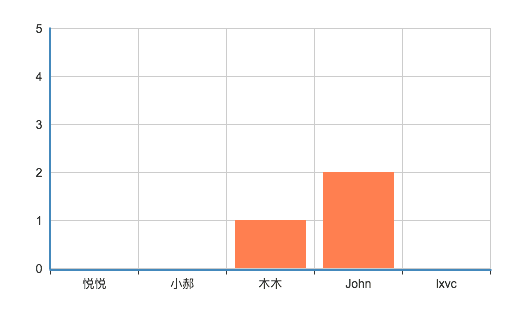
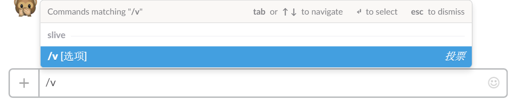
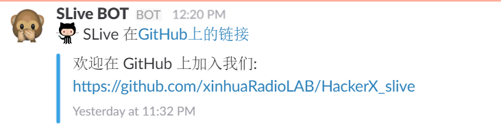

# Slive

- A Project by **_Team 五轴飞行器 (Quincopter)_** built in **CareerX-HackerX Hackathon**.
- A **Slack Bot**, designed to assist *Speaker*s in *Group meetings*.

## **Polling**

When the current slide is a certain predefined page,
which has a **Polling Addin** inside,
**Polling BOT** will push the prompt into the *Channel*:

If one of them is chosen, the **Polling Addin** will update real time:

*Audience* can also use **/v Command** to vote:

## **Navigate Slides**

When the Presentation is started, **SLive BOT** will push this:

And the *Speaker* can Control his Slides by tapping the buttons.

## **Push Information**

When the current slide is a certain predefined page, where the *Speaker*
wants to push some Information to the *Channel*, **SLive BOT** will help:

Features:

- Unmanly Push
- Sync with your Slide

## **API Contrasts** during the Hackathon

- **Slack Fallback Host** requires *HTTPS*
- **Office Addin Page** requires *HTTPS*
